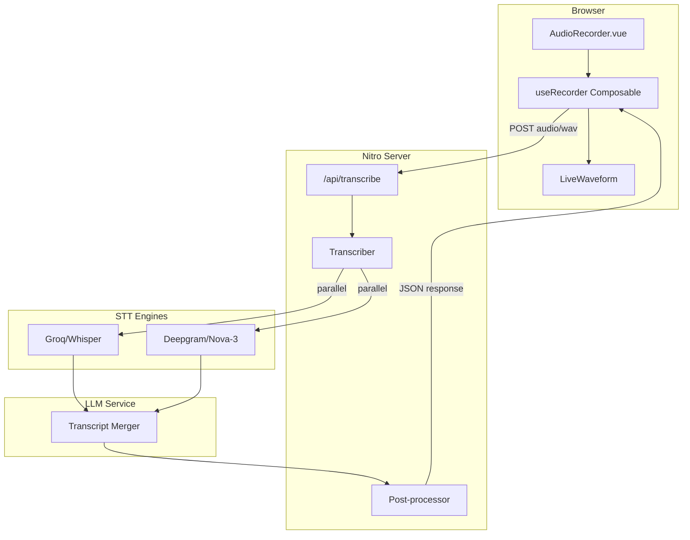
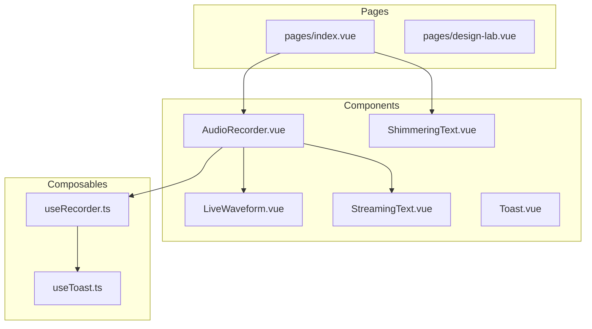
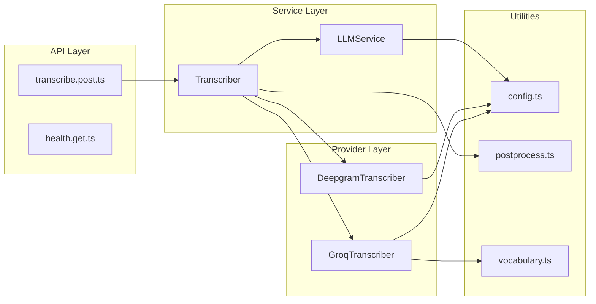
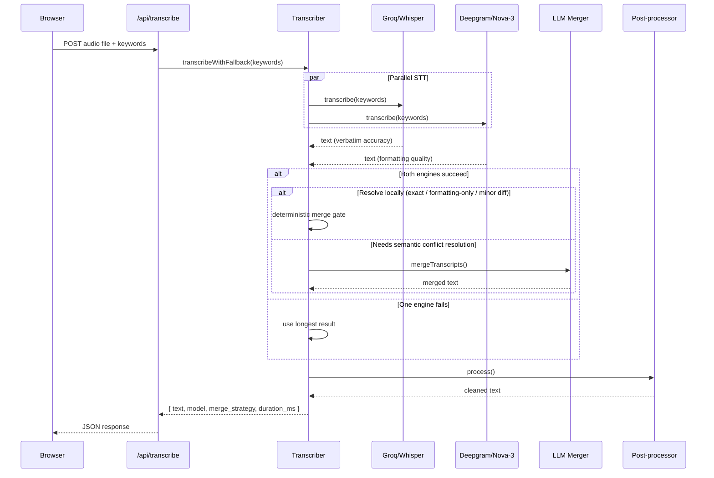
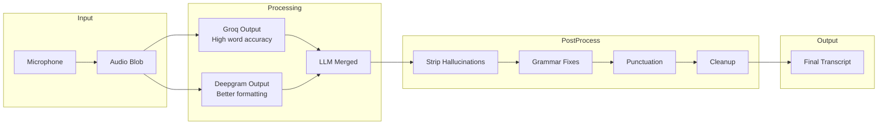

# Voice Web

AI-powered speech-to-text transcription with dual STT engines and intelligent merging.

## Features

- **Dual STT Engine Architecture** - Runs Groq (Whisper Large V3) and Deepgram (Nova-3) in parallel
- **LLM-Powered Merging** - Combines the accuracy of Whisper with Deepgram's formatting intelligence
- **Real-time Audio Visualization** - Live waveform display during recording
- **Custom Vocabulary** - Boost recognition of domain-specific terms and names
- **Smart Post-processing** - Grammar fixes, hallucination filtering, punctuation normalization
- **Non-English Detection** - Guards against non-English audio with clear user feedback

## Architecture

### System Overview



### Component Hierarchy



### Server Architecture



### Transcription Flow



### Data Flow



## Tech Stack

| Layer | Technology |
|-------|------------|
| Framework | Nuxt 3 |
| Frontend | Vue 3 Composition API |
| Styling | Tailwind CSS |
| Server | Nitro |
| STT Engine 1 | Groq (Whisper Large V3) |
| STT Engine 2 | Deepgram (Nova-3) |
| LLM | Groq (Llama 3.3 70B) |
| Deployment | Vercel |
| Package Manager | Bun |

## API Reference

### POST /api/transcribe

Transcribe an audio file using dual STT engines.

**Request:**
- Content-Type: `multipart/form-data`
- Body:
  - `file` (required): Audio file (wav, mp3, webm, ogg)
  - `keywords` (optional): JSON array of boost words

**Response:**
```json
{
  "text": "Transcribed text content",
  "model": "merged | groq:whisper-large-v3 | deepgram:nova-3",
  "duration_ms": 1234,
  "llm_improved": true,
  "merge_strategy": "llm | llm_fallback | exact_match | normalized_match | formatting_only | minor_diff | single_word_match | single_provider",
  "merge_reason": "llm_succeeded | llm_error_fallback | provider_fallback | ...",
  "fallback_used": false,
  "warnings": []
}
```

**Error Responses:**
- `400` - No file uploaded
- `422` - Non-English audio detected
- `500` - Transcription failed
- `503` - Transcriber not initialized

### GET /api/health

Health check endpoint.

## Configuration

### Environment Variables

| Variable | Required | Description |
|----------|----------|-------------|
| `GROQ_API_KEY` | Yes | Groq API key for Whisper and LLM |
| `DEEPGRAM_API_KEY` | Yes | Deepgram API key for Nova-3 |

### Runtime Config

Configuration is managed in `server/utils/config.ts`:

```typescript
{
  groq: {
    enabled: true,
    model: 'whisper-large-v3',
    timeoutMs: 30000
  },
  deepgram: {
    enabled: true,
    model: 'nova-3',
    timeoutMs: 30000
  },
  llm: {
    enabled: true,
    model: 'llama-3.3-70b-versatile',
    baseUrl: 'https://api.groq.com/openai/v1',
    timeoutMs: 30000
  }
}
```

## Setup

### Prerequisites

- Node.js 18+ or Bun
- Groq API key
- Deepgram API key

### Installation

```bash
# Clone repository
git clone <repo-url>
cd voice_web

# Install dependencies
bun install

# Configure environment
cp .env.example .env
# Edit .env with your API keys
```

### Development

```bash
bun run dev
```

### Production Build

```bash
bun run build
bun run preview
```

### Deploy to Vercel

```bash
vercel
```

## Project Structure

```
voice_web/
├── app.vue                    # Root component
├── nuxt.config.ts             # Nuxt configuration
├── pages/
│   ├── index.vue              # Main transcription page
│   └── design-lab.vue         # UI component playground
├── components/
│   ├── AudioRecorder.vue      # Recording UI & controls
│   ├── LiveWaveform.vue       # Real-time audio visualization
│   ├── StreamingText.vue      # Text display with typing effect
│   ├── ShimmeringText.vue     # Animated tagline
│   └── Toast.vue              # Notification component
├── composables/
│   ├── useRecorder.ts         # Recording & upload logic
│   └── useToast.ts            # Toast state management
├── server/
│   ├── api/
│   │   ├── transcribe.post.ts # Main transcription endpoint
│   │   └── health.get.ts      # Health check
│   └── utils/
│       ├── config.ts          # Configuration management
│       ├── transcribe.ts      # Transcriber orchestrator
│       ├── groq.ts            # Groq/Whisper integration
│       ├── deepgram.ts        # Deepgram/Nova-3 integration
│       ├── llm.ts             # LLM service (merging, improvement)
│       ├── postprocess.ts     # Text cleanup utilities
│       └── vocabulary.ts      # Custom vocabulary prompts
├── assets/
│   └── css/main.css           # Global styles
└── public/
    ├── favicon.svg
    └── logo.svg
```

## How It Works

### Dual Engine Strategy

Voice Web uses two STT engines with complementary strengths:

1. **Groq/Whisper** - Excellent word-level accuracy, especially for technical terms
2. **Deepgram/Nova-3** - Superior punctuation, formatting, and number handling

Both run in parallel. When both succeed, an LLM merges the results:
- Uses Whisper's words for content accuracy
- Uses Deepgram's formatting for punctuation and structure
- Removes self-corrections and filler words

### Post-processing Pipeline

1. **Hallucination Filtering** - Removes common Whisper hallucinations ("Thank you for watching", etc.)
2. **Grammar Fixes** - Fixes contractions, capitalizes proper nouns
3. **Punctuation Mapping** - Converts spoken punctuation ("new line" → `\n`)
4. **Smart Cleanup** - Normalizes spacing, capitalizes sentence starts

### Custom Vocabulary

Users can boost specific terms via the settings modal. These are:
- Sent to Deepgram as `keyterm` parameters
- Prioritized for domain-specific recognition (names, products, technical terms)

## License

MIT
